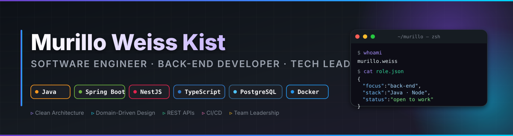

<h1 align="center">👋 Olá, eu sou o Murillo Weiss Kist</h1>

  

  
  &nbsp;
  
  &nbsp;
  
  &nbsp;
  

🎓 Estudante de <b>Engenharia de Software (6º período)</b>  
💻 Desenvolvedor back-end/full stack | entusiasta de servidores e automação  
🕹️ Fundador e gestor financeiro da rede de servidores <b>AusTV</b>  
🌍 Apaixonado por tecnologia, inovação e experiências imersivas

---

## 🚀 Sobre mim

Sou estudante de Engenharia de Software e desenvolvedor apaixonado por criar soluções inteligentes — desde **sistemas web modernos** até **plataformas para games e automação**.  
Tenho grande interesse em construir experiências imersivas e sistemas de alta performance.

Atualmente, divido meu tempo entre:

- 🧠 **Desenvolvimento full stack**, explorando novas tecnologias e arquiteturas
- 🕹️ **Gestão e expansão da rede AusTV**, um projeto ambicioso no universo de Minecraft

### 🧭 Em 1 minuto

- 👨‍💻 20 anos, focado em back-end e arquitetura limpa
- 🕹️ Fundador/gestor da AusTV: administração, infraestrutura e organização de equipe
- 🤝 Curto liderar squads, planejar entregas e automatizar processos
- 🚀 Objetivo: construir experiências imersivas e escaláveis para games e web

---

## 🛠️ Tecnologias e Ferramentas

### 💻 Desenvolvimento Web

- **Frontend:** Angular • Next.js • React
- **Backend:** NestJS • Node.js • Express
- **Banco de Dados:** PostgreSQL • Supabase • Prisma
- **Outros:** Docker • Git • REST APIs • JWT • Clean Architecture

### 🧰 Ferramentas de Desenvolvimento

- Visual Studio Code • Postman • Figma • GitHub • Notion

  

---

## 🧩 Projetos em destaque

### 🕹️ **AusTV Network**

Rede de servidores de Minecraft 1.21.8, com foco em:

- ⚔️ PvP balanceado (1.8 e 1.9)
- 💎 Itens e encantamentos customizados
- 🌍 Mundo e eventos personalizados
- 💰 Economia integrada e sistema de lootbox
- 🧑‍🤝‍🧑 Organização de equipe, processos e cronograma de conteúdo

> Responsável pela **gestão financeira**, **agenda de eventos** e **planejamento de expansão**.

---

## 📊 Estatísticas do GitHub

  
  

  

  

  

### ⏱️ Produtividade semanal

  

---

## 🔥 Agora

- 📌 Estudando aprimoramentos de arquitetura limpa e automação de deploy
- ️ Evoluindo a infraestrutura e o ecossistema do servidor AusTV

### 🤝 Aberto a colaborações

- Projetos de back-end (NestJS/Node.js) e automação
- Otimização de infraestrutura para servidores de Minecraft
- Mentoria/organização de times e processos de entrega

---

## 🏷️ Status deste repositório

  
  
  
  
  

---

## 🌐 Onde me encontrar

  
  
  

---

💬 "A tecnologia é a ponte entre a imaginação e a realidade."

